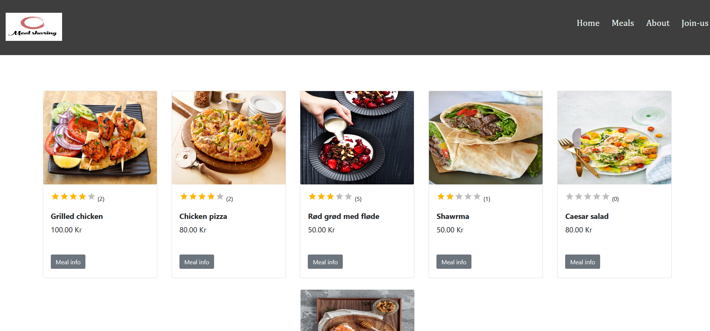

<h3 align="center">Meal sharing api</h3>

---

 Website api for sharing meals together. Invite your best friends or your family for dinner!
      

<h3>Improvments</h3>

 New features:  
- User account   
- Login   
- User can delete or edit his meals or reservation from his account page  
- User can change a meal to not active from his account page  
- Search   
- Sort by price   
- Show meals with available reservations   
- Show meals with high rating review stars   
- Pagination   

Backend :  
- Add unit testing by jest and TDD
 

Frontend : 
 - Add Typescript    
 -  

## 🧠About 

Link to deployed website: 

This project will be built out over 3 different classes:

## 🏁 Getting Started 

## Deployment 

### Prerequisites

- Postman
- MySQL Workbench

### Installing

To install run `npm install`

## 🈠Usage 

To run `npm run dev`

The api can now be found on `http://localhost:3000/api/` an example is `http://localhost:3000/api/meals`

## ⛏️ Built Using 

- [Mysql](https://www.npmjs.com/package/mysql) - Database
- [Express](https://expressjs.com/) - Server Framework
- [NodeJs](https://nodejs.org/en/) - Server Environment

## ✍️ Authors 

- [@islam-fawzy25](https://github.com/islam-fawzy25) - Idea & Initial work
