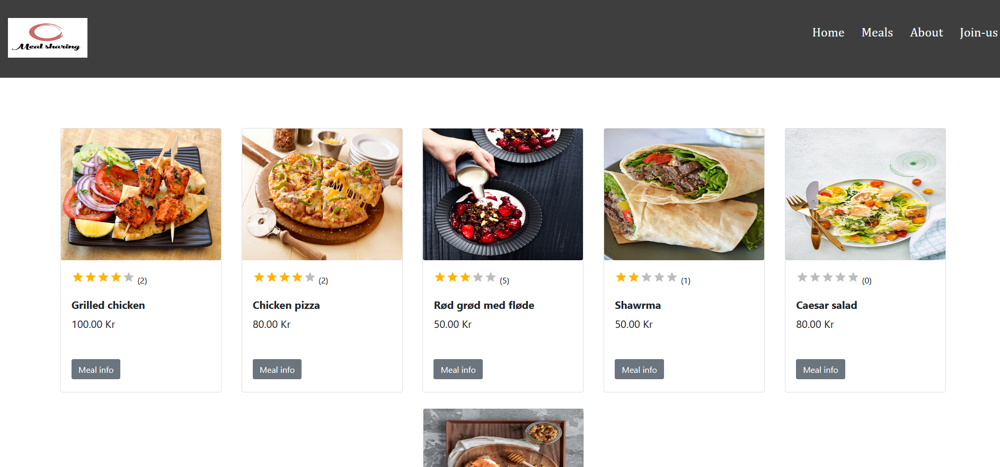

  

<h3 align="center">Meal sharing api</h3>

---

 Website api for sharing meals together. Invite your best friends or your family for dinner!
      

## 📝 Table of Contents

- [About](#about)
- [Getting Started](#getting_started)
- [Deployment](#deployment)
- [Usage](#usage)
- [Built Using](#built_using)
- [TODO](../TODO.md)
- [Contributing](../CONTRIBUTING.md)
- [Authors](#authors)
- [Acknowledgments](#acknowledgement)

<h3>Improvments</h3>

New features:  
 - Building Login page   
 - User page to delete and edit his meals and reservations  
 - Only user how compelet his reservation can review the meal   
    
   
  

Backend :  
- Add unit testing / jest and TDD
 

Frontend : 
 - Add Typescript    
 -  

## 🧐 About 

## 🏁 Getting Started 

## Deployment 

### Prerequisites

- Postman
- MySQL Workbench

### Installing

To install run `npm install`

## 🎈 Usage 

To run `npm run dev`

The api can now be found on `http://localhost:3000/api/` an example is `http://localhost:3000/api/meals`

## ⛏️ Built Using 

- [Mysql](https://www.npmjs.com/package/mysql) - Database
- [Express](https://expressjs.com/) - Server Framework
- [NodeJs](https://nodejs.org/en/) - Server Environment

## ✍️ Authors 

- [@islam-fawzy25](https://github.com/islam-fawzy25) - Idea & Initial work
